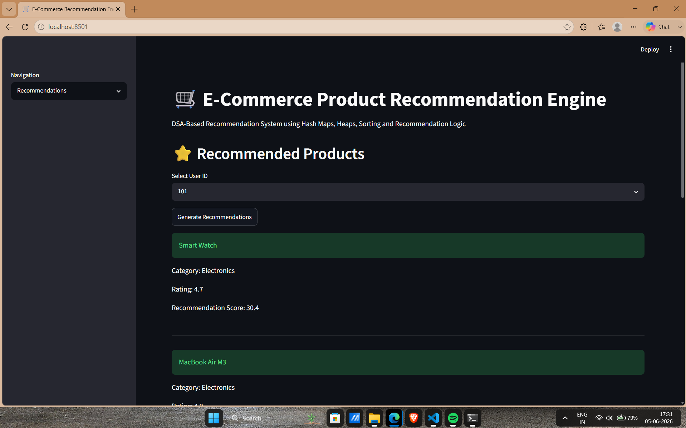

# 🛒 E-Commerce Product Recommendation Engine

## 📌 Project Overview

The E-Commerce Product Recommendation Engine is a Data Structures and Algorithms (DSA) based project developed using Python. The system analyzes user behavior such as purchases, searches, cart activity, and ratings to generate personalized product recommendations.

The project demonstrates how recommendation systems used by modern e-commerce platforms like Amazon, Flipkart, and Myntra can be implemented using core DSA concepts such as Hash Maps, Heaps, Sorting, Searching, and Object-Oriented Programming.

In addition to recommendation generation, the project provides product management, user management, analytics dashboards, CSV export functionality, persistent JSON storage, and a Streamlit-based web interface.

---

## 🎯 Problem Statement

Online shopping platforms contain thousands of products. Users often struggle to find relevant products efficiently.

The objective of this project is to:

* Recommend products based on user behavior.
* Improve product discovery.
* Demonstrate practical applications of DSA.
* Simulate a real-world recommendation engine.

---

## 🚀 Features

### Recommendation System

* Personalized product recommendations
* Category-based recommendations
* Similar product recommendations
* Product ranking using recommendation scores

### Product Management

* View products
* Add products
* Delete products
* Persistent storage using JSON

### User Management

* View users
* Add users
* User-specific recommendations

### Search Functionality

* Case-insensitive product search
* Fast product lookup

### Analytics Dashboard

* Total products
* Total users
* Average product rating
* Highest rated product
* Product distribution by category

### Export & Reporting

* Generate recommendation reports
* Export recommendations to CSV

### Frontend

* Streamlit-based web interface
* Interactive navigation
* User-friendly dashboard

---

## 🏗️ System Architecture

```text
User Activity
│
├── Purchase History
├── Search History
├── Cart Items
└── Ratings
        │
        ▼
Recommendation Engine
        │
        ▼
Similarity Scoring
        │
        ▼
Product Ranking
        │
        ▼
Priority Queue (Heap)
        │
        ▼
Top Recommended Products
```

---

## 📂 Project Structure

```text
E-Commerce-Product-Recommendation-Engine/
│
├── data/
│   ├── products.json
│   └── users.json
│
├── src/
│   ├── models.py
│   ├── data_loader.py
│   ├── recommender.py
│   ├── report_generator.py
│   └── csv_export.py
│
├── outputs/
│
├── images/
│
├── app.py
├── main.py
├── README.md
├── requirements.txt
└── .gitignore
```

---

## 🧠 DSA Concepts Used

| Concept                | Usage                                  |
| ---------------------- | -------------------------------------- |
| Hash Maps (Dictionary) | Product & User Storage                 |
| Lists                  | Product Collections                    |
| Sets                   | Purchased Product Filtering            |
| Sorting                | Product Ranking                        |
| Heap / Priority Queue  | Top-N Recommendations                  |
| Linear Search          | Product Search                         |
| Aggregation            | Analytics Dashboard                    |
| File Handling          | JSON Persistence                       |
| OOP                    | Product, User & Recommendation Classes |

---

## ⚙️ Technologies Used

* Python
* Streamlit
* JSON
* CSV
* Heapq
* Collections
* Object-Oriented Programming

---

## 🔍 Recommendation Logic

The recommendation score is calculated using:

### Factors Considered

* Search History Match
* Cart Activity
* Product Rating
* Previously Purchased Categories

### Formula

```text
Score =
(Search Match Weight)
+ (Cart Weight)
+ (Product Rating Weight)
+ (Category Preference Weight)
```

Products are ranked using a Priority Queue (Heap) and the highest scoring products are recommended to the user.

---

## 📊 Analytics Dashboard

The dashboard provides:

* Total Products
* Total Users
* Average Rating
* Highest Rated Product
* Product Distribution by Category

Example:

```text
Total Products: 11
Total Users: 2

Average Rating: 4.59

Highest Rated Product:
MacBook Air M3 (4.9)

Products Per Category:
Electronics: 5
Fashion: 3
Accessories: 2
Gaming: 1
```

---

## 💻 How to Run (CLI Version)

### Clone Repository

```bash
git clone https://github.com/Aryan-05CS/E-Commerce-Product-Recommendation-Engine
```

### Navigate to Project

```bash
cd E-Commerce-Product-Recommendation-Engine
```

### Install Dependencies

```bash
pip install -r requirements.txt
```

### Run Application

```bash
python main.py
```

---

## 🌐 How to Run (Streamlit Web App)

Install Streamlit:

```bash
pip install streamlit
```

Run:

```bash
streamlit run app.py
```

Open:

```text
http://localhost:8501
```

---

## 📸 Screenshots

### Home Page


### Product Catalog


### Search Product


### Recommendations



### Analytics Dashboard


---

## 📈 Sample Output

```text
Top Recommendations

Smart Watch | Score=30.4
MacBook Air M3 | Score=20.8
Samsung Galaxy S24 | Score=20.4
Laptop Stand | Score=12.2
Laptop Backpack | Score=11.4
```

---

## 🎓 Learning Outcomes

Through this project, I learned:

* Practical implementation of recommendation systems
* Hash Map-based data storage
* Heap and Priority Queue operations
* Product ranking algorithms
* JSON persistence
* CSV generation
* Object-Oriented Programming
* Streamlit web development
* Real-world DSA applications

---

## 🔮 Future Enhancements

* Trie-Based Product Search
* Collaborative Filtering
* User-to-User Similarity
* Product Popularity Analytics
* Wishlist System
* Recently Viewed Products
* Recommendation Graphs
* Database Integration (MySQL/PostgreSQL)
* REST API Development
* Deployment on Cloud

---

## 👨‍💻 Author

Aryan Choughule

Engineering Student | Python Developer | DSA Enthusiast | Cybersecurity Aspirant

---

## ⭐ Support

If you found this project useful, consider giving it a star on GitHub.
